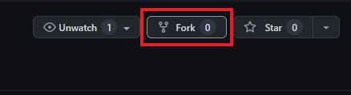

# DAD JOKES WEBSITE

### [GlitchedFailure video](placeholder!)

## How to download project?

1. Fork this repo
   - 
2. `git clone` the repo from YOUR FORKED REPO:
   - via HTTPS
     - `git clone https://github.com/{YOUR USERNAME}/dad_jokes.git`
   - OR SSH
     - `git clone git@github.com:{YOUR USERNAME}/dad_jokes.git`
   - _NOTE: DO NOT download the repo as a ZIP file, since this will not preserve the commit history, which is the point of the exercise!_

---

#### Uses the [icanhazdadjoke API](https://icanhazdadjoke.com/api)

Features a simple React website featuring:

1. A list of dad jokes
2. A button to get more dad jokes
3. Really cool styling!
4. Fun emojis
5. No errors whatsoever!
